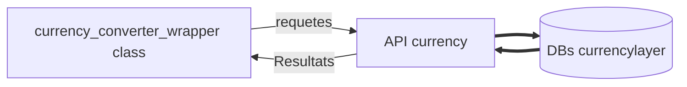

###  currency converter Project

currency converter(Convertisseur de devises en francais),

est un projet informatique permettant de convertir le montant d'une devise monetaire en une autre

### Fonctionnalité
```
- Plus de 168 devises monetaire dans le monde supportees
- Taux de change des devises en temps reel
- Execution sur une invite de commande
- Execution sur un serveur web en produisant une interface graphique ergonomique
```

### Comment ça marche

- **Generale:**

Le pragramme utlise la librairie  **[pycurl](http://pycurl.io/docs/latest/)** 

pour effectuer des requetes aupres de l'API currencylayer(API fournissant des donnees sur le taux de cange en temps reel )

> Currencylayer fournit une API REST basée sur JSON, offrant des taux de change fiables et précis pour 168 devises mondiales et métaux précieux à un prix abordable, ce qui en fait l'instrument parfait pour les startups et les entreprises en ligne, ainsi que pour les grandes entreprises ayant besoin de fiabilité données financières via une interface facile à utiliser. L'API de currencylayer est largement utilisée pour alimenter les services financiers, les applications mobiles et les systèmes de back-office du monde entier. [(documentation complete ...)](https://currencylayer.com/documentation)




- **Fonctionnement web**

La technologie GCI des serveur web permettent d'executer ce programme et ainsi generer du contenu web affichable sur sur un navigateur internet.

Definition du CGI(d'apres le site officiele de apache)

> CGI (Common Gateway Interface) définit une méthode d'interaction entre un serveur web et des programmes générateurs de contenu externes, plus souvent appelés programmes CGI ou scripts CGI. Il s'agit d'une méthode simple pour ajouter du contenu dynamique à votre site web en utilisant votre langage de programmation préféré. [plus de details](https://httpd.apache.org/docs/current/howto/cgi.html)


### Comment executer
1. Telecharger le projet avec git:

  `git clone https://gitlab.com/abdoulfataoh/currency-converter.git`

2. Deplacer vous dans le dossier principale du projet

`cd currency-converter`

- Excecuter en tanque que service web avec docker
Nous avons facilite le deployement de cette application, en definition un environnement d'execution base sur un conteneur docker.

`docker-compose up -d`

Tester sur un navigateur web en saississant ce url
[http://localhost:8080/cgi-bin/index.py](url)

- Excecuter en ligne de commande sans graphisme

Installation des prerequis 

` pip install -r requierements.txt`

Execution du programme 

`python3 app/currency_converter_wrapper.py`


